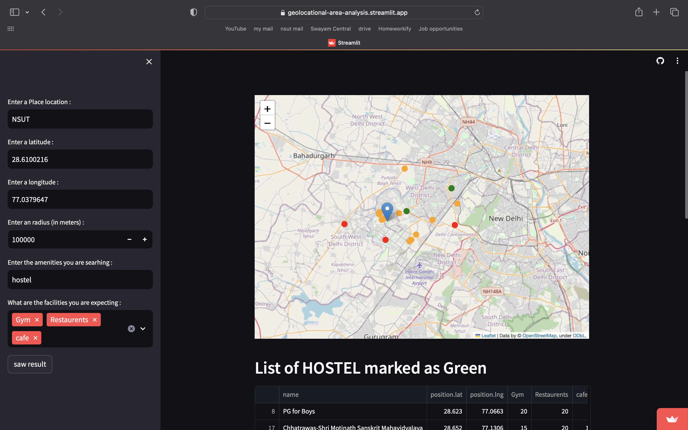

# :zap: Automated Solution Comparison and Testing Framework

<a href="https://automated-solution-comparison-and-testing-framework.streamlit.app/" target="_blank">Visit Site</a>

I engineered an automated error detection and comparison framework to enhance software development and debugging processes. The core objective of this framework is to detect discrepancies between incorrect and correct solutions to a given problem. 

In short, suppose you write a code but it's giving wrong answer to some test case but you don't know the test case, you can use this to generate many test cases to identify on which test case it is giving wrong output. 

Just make sure the cpp environment is set up in your local machine. In simple language, if you can run any cpp code and compile it using g++ -std=c++17 at your computer that't enough (Mac users keep in mind that mac default uses clang compiler not gcc. make sure your terminal can complie code using g++ -std=c++17 ). if face any problem you can modify checker.sh file. You can also modify this project for java by modifying checker.sh file

## Components :
1. Incorrect Solution (incorrect_solution.cpp):
    This file contains the cpp code you have written which is giving wrong output to some input.
2. Correct Solution (correct_solution.cpp):
    This file contains the correct cpp code
3. Test Case Generator (test_case_generator.cpp):
    This file is used to generate random test cases which is used as input to both above file.
4. Checker Script (checker.sh): 
    This file contains the code which is used to run above files and store results of above files in seperate txt file which is used as the input and output accordingly

 ## :camera: How to run :

1. Just download all the files 
2. Paste the Correct and Incorrect cpp code to correct_solution.cp and incorrect_solution.cpp files respectively.

    

    

3. Write a cpp code to generate test cases that will be used as input to other file.

    

4. Open Terminal
5. Navigate to the Repository Directory
6. Write command ->  bash checker.sh

    

7. Then just press enter and done.

    

<!-- ## :camera: Screenshots -->

